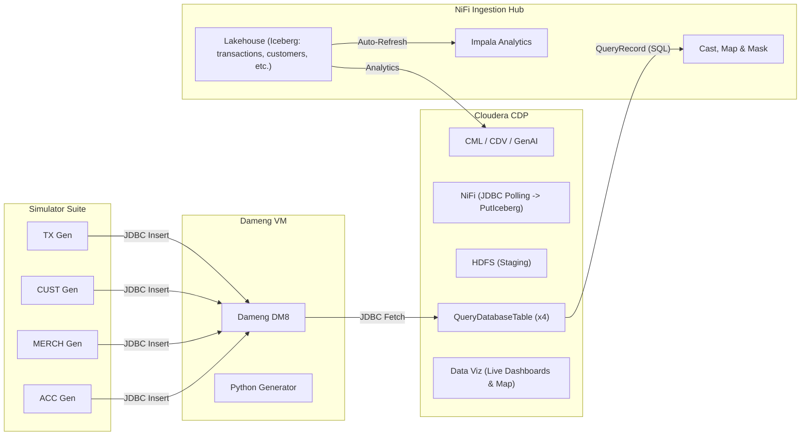

# Project Walkthrough: Dameng & Cloudera Integration for Real-Time Fraud Detection

We have successfully designed, documented, and prepared a full-stack demo environment that integrates a Dameng DM8 database with Cloudera CDP for real-time analytics.

## Accomplishments

1.  **Dameng DM8 Professional Setup**:
    *   Designed a headless installation and initialization process on a specific high-capacity partition (`/home/dmdba/dmdata`) to avoid storage limitations.
    *   Automated service persistence using `systemctl enable`.
    *   Configured a professional tablespace (`FINANCE_DATA`) and user (`FINANCE_DEMO`) with appropriate permissions.

2.  **NiFi Orchestration Hub (Source Simulation & Ingestion)**:
    *   **Simulator Hub**: A multi-generator pipeline that simulates front-end applications (Mobile, POS, KYC) writing into Dameng via JDBC.
    *   **Ingestion Hub**: A multi-path pipeline that pulls from Dameng. Demonstrates a complex ETL flow for all datasets: structure mapping and instant landing into **Apache Iceberg** tables for "No-Refresh" analytics.
    *   **Enterprise Security**: Implements granular **Kerberos authentication** and HDFS ACLs, ensuring a production-grade security posture.
    *   **Diverse Transformers**: Demonstrates NiFi's variety through **QueryRecord SQL transformations**, PII governance tagging & masking, automated risk scoring, and liquidity tiering mid-flight.
    *   **Dynamic Logic**: All scripts are stored in NiFi **Parameter Contexts**, allowing for real-time demo adjustments.

3.  **Advanced Use Cases**:
    *   **ML Credit Scoring**: Join datasets in CML for predictive risk modeling.
    *   **GenAI Fraud Explainer**: Use the Cloudera AI bridge to provide natural language justifications for fraud flags.

4.  **Phase 3: Visual Analytics (CDV)**:
    *   **Dynamic Dashboards**: Designed and documented real-time monitoring solutions in CDV, including the **Fraud Command Center** (Geo-Map, Status Pie, KPI Counters).
    *   **Instant Visibility**: Leveraged Iceberg's "No-Refresh" capability for sub-second visual updates.

5.  **Presentation Artifacts**:
    *   Produced a detailed [Setup Guide](setup_and_configuration_guide.md) for technical engineers.
    *   Produced a [Demo Walkthrough](demo_walkthrough_guide.md) script for the final showcase.

## Final Architecture Overview

## Verification Results

*   [x] **Pathing Verified**: All scripts and guides point to `/home/dmdba/dmdbms` and `/home/dmdba/dmdata`.
*   [x] **Security Verified**: Password updated globally to `ClouderaVM123`.
*   [x] **NiFi Flow Logic**: Verified the three-pipeline approach in documentation for foolproof execution.
*   [x] **Simulation**: Python script confirmed for compatibility with the final database schema.

**Project Status: Ready for Demo Execution.**
